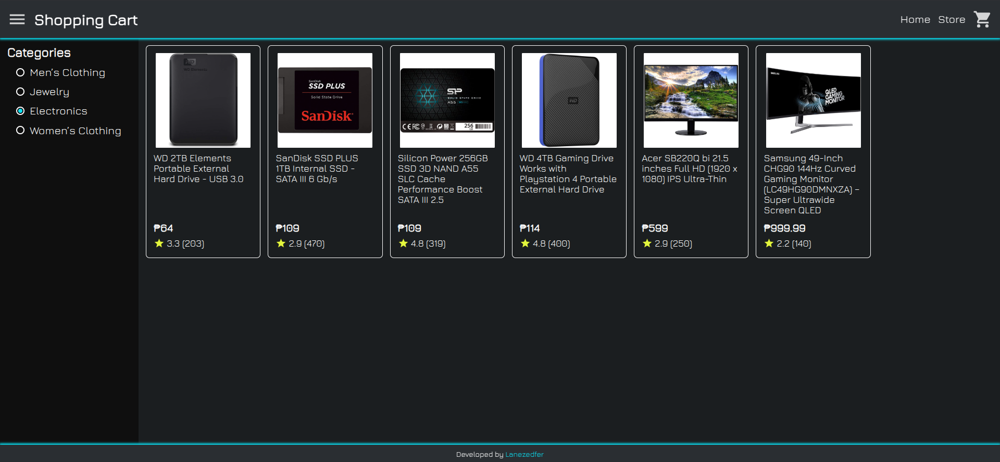
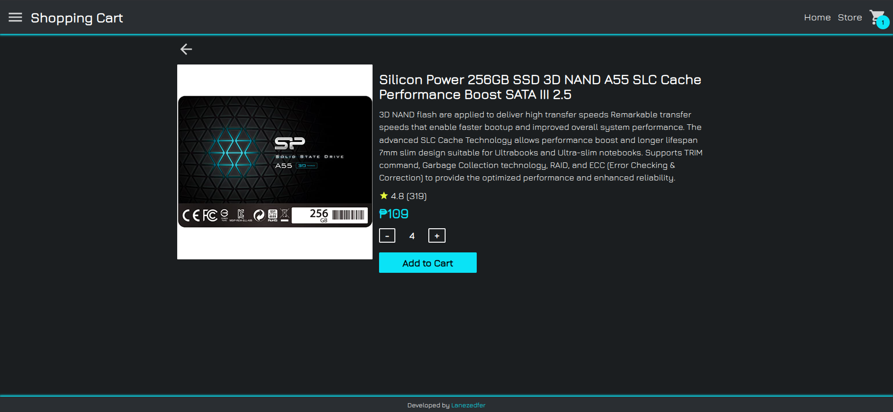
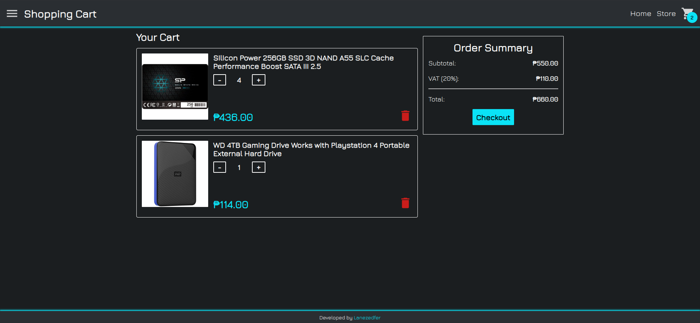

# shopping-cart
__shopping-cart__ is a personal project developed as part of the [__React__](https://www.theodinproject.com/lessons/node-path-react-new-shopping-cart) course from [__The Odin Project__](https://www.theodinproject.com).

### This personal project was undertaken to learn and practice the following:
* CSS Modules
* Fetching Data in React
* React Context API
* React Router
* Type Checking
* Vite

## Preview

  
  
  
  <a href="https://lanezedfer-shopping-cart.netlify.app">Link to Live Preview</a>

## Requirements
* Node.js
* npm (Installed as part of Node.js)

## Getting Started
1. Run the following command to clone the project into your specified directory:

`git clone https://github.com/Lanezedfer/shopping-cart.git`

2. Navigate to the project's directory then run the following command to install the dependencies:

`npm install`

3. Run the following command to start the development server:

`npm run dev`

4. Run the following command to build the project for production:

`npm run build`

# Acknowledgements
### API:
* [__Fake Store API__](https://fakestoreapi.com/)

### Course:
* [__The Odin Project__](https://www.theodinproject.com/about)

### Font Used:
* [__Jura__](https://fonts.google.com/specimen/Jura/about)

### Icons Used:
* [Pictogrammers](https://pictogrammers.com)

# License
This project is distributed under the MIT License. View [`LICENSE.txt`](LICENSE.txt) for more information.

# Author
* Lance Ezeckel P. Fernando (fernando.lance.eze@gmail.com)
